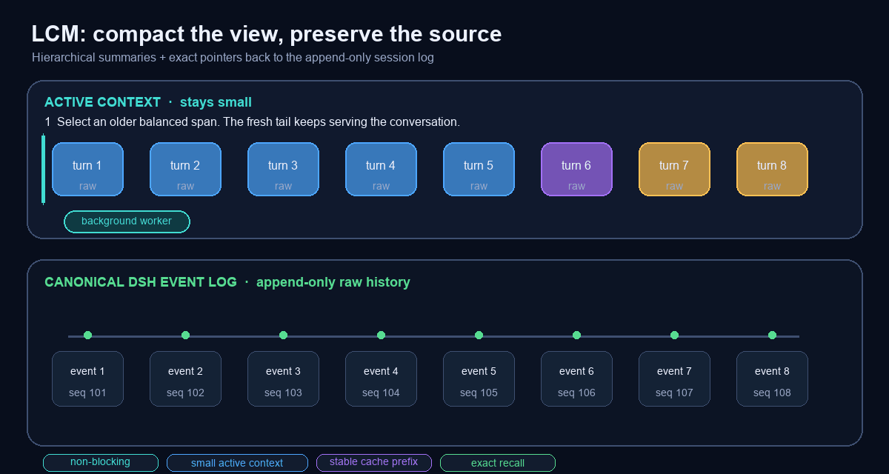

# SuperLcm — Lossless Context

[中文（默认）](./README.md) · [Releases](https://github.com/ygc3817922006-sketch/SuperLcm-Lossless-Context/releases) · [LCM paper](https://papers.voltropy.com/LCM)

[](https://github.com/ygc3817922006-sketch/SuperLcm-Lossless-Context/actions/workflows/ci.yml)
[](https://github.com/ygc3817922006-sketch/SuperLcm-Lossless-Context/releases)
[](./LICENSE)

**SuperLcm is an asynchronous context-compaction and lossless-recall plugin for DeepSeek Harness (DSH).** Instead of permanently replacing a long conversation with one opaque flat summary, it preserves DSH's original event log, builds a hierarchical summary DAG, and lets the Agent search and expand exact earlier context on demand.

> Current `main` version: `0.3.0-alpha.10`; the latest public Release remains `0.3.0-alpha.9`. Pin DSH and SuperLcm versions in a dedicated profile before enabling it in a primary workspace.

<p align="center">
  <a href="https://www.losslesscontext.ai/">
    
  </a>
</p>
<p align="center"><strong>Click the image to open the paper team's official interactive LCM explainer</strong></p>

The official page is a script-driven, scroll-based interactive animation rather than a downloadable MP4/WebM file. GitHub README files cannot execute that external application, so this README displays its official preview and links to the original experience. The repository-native GIF below illustrates the exact architecture implemented by SuperLcm:



## Five goals

1. **Implement the LCM idea:** keep canonical raw events, create a hierarchical summary DAG, and retain exact source pointers.
2. **Compact asynchronously:** a detached worker and summarizer model prepare results off the active reply path.
3. **Keep active context bounded:** carry stable checkpoints, relevant raw text, and a fresh tail instead of replaying the full transcript every turn.
4. **Improve cache reuse and reduce cache volume:** freeze the leading system/checkpoint prefix and shorten the changing suffix.
5. **Make summaries searchable and originals recoverable:** SQLite is a rebuildable index; `lcm_expand` ultimately returns exact DSH events.

## 1. The LCM principle

SuperLcm is inspired by Clint Ehrlich and Theodore Blackman's **[LCM: Lossless Context Management](https://papers.voltropy.com/LCM)**. See the paper team's **[official interactive visual explainer](https://www.losslesscontext.ai/)** or [arXiv:2605.04050](https://arxiv.org/abs/2605.04050).

Traditional flat compaction:

```text
messages 1 … 100  ──compact──>  one flat summary
                                      └─ omitted details may no longer be locatable
```

LCM-style compaction:

```text
DSH append-only event log (canonical raw source)
   │
   ├─ events 101–130 ─> S0-A ─┐
   ├─ events 131–160 ─> S0-B ─┼─> S1-A ─┐
   ├─ events 161–190 ─> S0-C ─┘         ├─> higher summaries
   └─ recent events ─────────────────────┘

Every summary retains: node_id, child_ids, source event seqs
```

Low-level summaries cover exact raw-event ranges. Higher summaries can cover earlier summary nodes. The model navigates with summaries, then follows DAG edges and source sequence IDs back to original events whenever details matter.

## 2. Fully asynchronous compaction

SuperLcm accepts one automatic mode:

```yaml
mode: rolling
foldTiming: background
```

```mermaid
sequenceDiagram
    participant U as User
    participant A as Active Agent
    participant W as Background Worker
    participant S as DSH Session Log
    participant DB as SQLite Index

    U->>A: Continue the conversation
    A-->>U: Reply normally; do not wait
    A->>W: Stage a stable historical span
    W->>W: Summarize through detached provider/model
    W->>S: Atomically commit start → summary → checkpoint → end
    S->>DB: Index only after successful completion
```

- The active reply does **not await the summarizer**.
- The worker uses an explicit provider/model and never silently falls back to the active Agent route.
- It uses its own abort controller.
- It snapshots a balanced historical range. Concurrent tail growth is allowed.
- If the selected range changes, the stale result is rejected and restaged.
- Only the complete successful DSH compaction lifecycle becomes indexable.

This does not make the summarizer's computation magically faster. It removes that computation from the user's reply-critical path, reducing compaction wait time.

The default policy preserves the newest 24 surface nodes and at least 32k recent tokens verbatim. A safe batch of roughly 64k historical tokens can be prepared early in the background; the ready checkpoint is committed when soft/hard pressure or overflow needs space.

## 3. Why a smaller active context helps

The active prompt consists of:

```text
frozen prefix: SYSTEM + CHECKPOINT 01 + CHECKPOINT 02 + …
foldable area: newer raw history
fresh tail: recent messages, tool calls, and current task state
```

A bounded active prompt:

- reduces distraction from stale unrelated history;
- leaves more room for reasoning, tool output, and the final answer;
- reduces long-context attention dilution;
- keeps request latency more predictable;
- changes old details from “always resend” to “retrieve only when relevant.”

The goal is not the smallest possible prompt. It is a controlled balance between an intact fresh tail and exact access to older history.

## 4. Prompt-cache optimization and lower cache cost

Prompt caches usually depend on the longest byte-identical prefix from the start of a request. Rewriting an old leading summary can invalidate reuse for everything after it.

```text
SYSTEM · CHECKPOINT 01 · CHECKPOINT 02 │ RAW HISTORY │ FRESH TAIL
└──────────── byte-stable cacheable prefix ───────────┘
```

SuperLcm therefore:

1. excludes the system message from routine folding;
2. freezes committed checkpoints;
3. compacts only raw history after the frozen prefix;
4. merges old checkpoints only under hard pressure when later history cannot free enough space;
5. never relies on a guessed provider cache TTL.

The cost effect has two sources: a stable prefix improves the chance of cache reuse and avoids repeated cache writes, while a smaller prompt reduces input tokens, uncached suffix size, and new cache-write volume. Exact hit rates and pricing remain provider-specific; this project does not claim a fabricated fixed savings percentage.

## 5. How lossless recall works

“Lossless” refers to **recoverability and provenance**, not to the summary text containing every detail.

```text
summary checkpoint
   │  marker: node_id + child_ids
   ▼
SQLite DAG node
   │  source_seqs: [101, 102, 103, ...]
   ▼
DSH append-only Session Event Log
   └─ exact original JSON events
```

Each summary receives a versioned machine-readable marker:

```text
<!-- dsh-lcm:v1:<base64url-json> -->
```

The marker carries a stable node ID and child node IDs. Exact source-event sequences come from the committed DSH compaction transaction. Parent/child edges are accepted only from genuine compact-checkpoint source events, preventing arbitrary user text from forging the DAG.

Recall path:

1. `lcm_grep` searches summaries and/or raw events;
2. `lcm_describe` shows hierarchy, parents, children, and source range;
3. `lcm_expand` follows `source_seqs` into the live DSH event log and returns exact serialized events;
4. large events continue through `source_offset` and `event_char_offset` until `next` is null;
5. `lcm_expand_query` searches summaries and expands relevant originals under one shared character budget.

## What SQLite stores

Default path:

```text
~/.dsh/SuperLcm/lcm.sqlite
```

Portable overrides are `DSH_SUPERLCM_DB` and `DSH_HOME`. Runtime paths use Node.js `node:path` and `node:os.homedir()`; there are no macOS-specific production paths.

| Table/index | Stored data | Raw transcript duplicated? |
| --- | --- | --- |
| `lcm_nodes` | summary JSON/text, node and child IDs, source seqs, ranges, provider/model, status | No |
| `lcm_edges` | per-session parent → child DAG edges | No |
| `lcm_nodes_fts` | FTS5 index over summary text | No |
| `lcm_scan_state` | incremental scan high-water per session | No |
| `lcm_index_state` | legacy committed-end cursor migration state | No |

SQLite runs in WAL mode. Nodes, edges, and FTS rows update transactionally under the composite identity `(session_id, node_id)`, isolating forks. SQLite is a derived index, not a second transcript store. If it is lost, `lcm_reindex` reconstructs it from complete successful compaction lifecycles in the DSH log. `lcm_doctor` is read-only unless `repair: true` is explicit.

## Tools

| Tool | Purpose |
| --- | --- |
| `lcm_grep` | Search summaries, raw events, or both |
| `lcm_describe` | Inspect one node's hierarchy and provenance |
| `lcm_expand` | Recover exact events with large-event pagination |
| `lcm_expand_query` | Search summaries and expand relevant originals |
| `lcm_reindex` | Refresh or rebuild the derived SQLite index |
| `lcm_doctor` | Check DAG, pointers, missing nodes, dangling edges, and SQLite integrity |

## Installation

Requires Node.js 22.16+ and the DSH compaction, LLM, tools, and session/event APIs.

Web profile:

```text
dsh plugin --profile web add "https://github.com/ygc3817922006-sketch/SuperLcm-Lossless-Context/releases/download/v0.3.0-alpha.9/SuperLcm-0.3.0-alpha.9.tgz"
```

ACP profile:

```text
dsh plugin --profile acp add "https://github.com/ygc3817922006-sketch/SuperLcm-Lossless-Context/releases/download/v0.3.0-alpha.9/SuperLcm-0.3.0-alpha.9.tgz"
```

The bundled `cordis.patch.yml` mounts only the six recall/repair tools. To enable compaction, **replace the existing compaction provider; do not append a second provider beside it.**

```yaml
name: SuperLcm
mode: rolling
summarizationProvider: openai
summarizationModel: gpt-5.6-sol
# Optional: retry once after primary failure; never use the main Agent.
fallbackSummarizationProvider: anthropic
fallbackSummarizationModel: claude-sonnet-4-5
tailCount: 24
minRetainTokens: 32000
pressureFoldTokens: 20000
foldBatchTokens: 64000
softActiveTokens: 160000
hardActiveTokens: 220000
foldTiming: background
```

The backup route is optional. When configured, its provider/model pair must be complete and different from the primary. It is tried exactly once only after primary failure and only while the task is not cancelled. If both fail, SuperLcm preserves both errors and never uses the main Agent model.

See [CACHE_POLICY.md](./docs/CACHE_POLICY.md) for policy details and [VALIDATION.md](./docs/VALIDATION.md) for the real-profile gate.

## Development

```text
npm run validate
npm pack --dry-run
```

CI covers Node.js 22 on Windows, Linux, and macOS, plus Node.js 24 on Linux. Automated checks are not a universal runtime certificate for every DSH build; pin versions and validate one real compaction/retrieval/restart cycle before primary-profile use.

## License and attribution

MIT. See [LICENSE](./LICENSE) and [THIRD_PARTY_NOTICES.md](./THIRD_PARTY_NOTICES.md).

SuperLcm is independent and is not affiliated with Voltropy, Martian Engineering, or DeepSeek. This repository does not copy source code from the LCM interactive site, Lossless Claw, or DSH. The README loads the official public preview URL and links back to the original interactive explainer.
