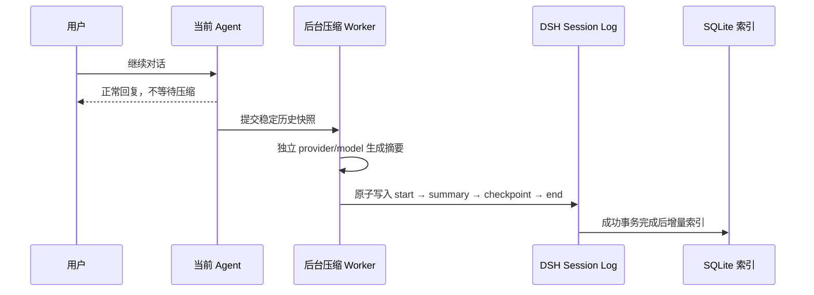

# SuperLcm — Lossless Context

> Claude Code CLI / Claude Desktop 适配预览版：[接入方法、隐私与边界](./docs/CLAUDE.md)。在原生压缩之外提供分层摘要与原文召回，不替换原生压缩。

[English](./README.en.md) · [Releases](https://github.com/ygc3817922006-sketch/SuperLcm-Lossless-Context/releases) · [LCM 论文](https://papers.voltropy.com/LCM)

[](https://github.com/ygc3817922006-sketch/SuperLcm-Lossless-Context/actions/workflows/ci.yml)
[](https://github.com/ygc3817922006-sketch/SuperLcm-Lossless-Context/releases)
[](./LICENSE)

**SuperLcm 是 DeepSeek Harness（DSH）的异步上下文压缩与无损召回插件。**它不把一段长对话永久替换成一个不可追溯的扁平摘要，而是保留 DSH 原始事件日志，建立分层摘要 DAG，并让 Agent 在需要时搜索、定位、展开之前的精确上下文。

> 源码 `package.json` 版本：`0.3.0-alpha.14`。Claude 适配仍为预览；DSH 与 Claude 接入请分别验证，不要把本地源码版本当作已安装或已发布版本。

<p align="center">
  <a href="https://www.losslesscontext.ai/">
    
  </a>
</p>
<p align="center"><strong>点击上图打开论文团队的 LCM 官方交互式动态讲解</strong></p>

官方页面并不是一个独立的 MP4/WebM 视频，而是由网页脚本驱动的滚动交互动画；GitHub README 不能运行外部网页脚本。因此这里直接加载官方预览并链接到原始动态页面，同时在仓库内提供一份原生 GIF，把 SuperLcm 实际采用的流程完整展示出来：


## 目录

- [五个核心目标](#五个核心目标)
- [LCM 的原理](#1-lcm-的原理)
- [全面异步压缩](#2-全面异步压缩不阻塞对话)
- [为什么保持较少上下文](#3-持续保持较少的活动上下文)
- [缓存优化与缓存成本](#4-缓存优化与更低的缓存成本)
- [为什么是无损召回](#5-lcm-怎么做到无损并拉回以前的上下文)
- [SQLite 里到底放了什么](#sqlite-里到底放了什么)
- [召回工具](#召回工具)
- [安装与启用](#安装与启用)

## 五个核心目标

1. **展示并实现 LCM 原理**：原文永久留在 DSH 事件日志中；摘要形成层级 DAG；摘要节点保留精确源事件指针。
2. **异步压缩，不阻塞对话**：独立 Worker 和独立模型在后台准备摘要，当前 Agent 回复不等待压缩模型。
3. **持续保持较少的活动上下文**：旧历史进入 checkpoint，主模型只携带稳定摘要、必要原文和 fresh tail。
4. **缓存更稳定、成本更低**：冻结 system/checkpoint 前缀，减少前缀重写；更短的活动请求也减少输入 token 与 cache write 体积。
5. **摘要可搜索，原文可精确取回**：SQLite 只做可重建索引，`lcm_expand` 最终返回的是 DSH 原始事件，而不是摘要的二次转述。

---

## 1. LCM 的原理

SuperLcm 受 Clint Ehrlich 与 Theodore Blackman 的论文 **[LCM: Lossless Context Management](https://papers.voltropy.com/LCM)** 启发。推荐先看论文团队制作的 **[官方交互式动态讲解](https://www.losslesscontext.ai/)**；论文也可在 [arXiv:2605.04050](https://arxiv.org/abs/2605.04050) 阅读。

传统压缩通常是：

```text
原始消息 1 … 100  ──压缩──>  一个扁平摘要
                                  │
                                  └─ 摘要遗漏的细节通常无法再定位
```

LCM 的方式是：

```text
DSH append-only event log（原始真源，始终保留）
   │
   ├─ events 101–130 ─> S0-A ─┐
   ├─ events 131–160 ─> S0-B ─┼─> S1-A ─┐
   ├─ events 161–190 ─> S0-C ─┘         ├─> 更高层摘要
   └─ recent events ─────────────────────┘

每个摘要节点都保留：node_id、child_ids、source event seqs
```

这意味着上下文可以递归压缩，但不是把过去抹掉：

- 低层摘要覆盖一段原始事件；
- 高层摘要可以覆盖多个低层摘要；
- 每一层都保留向下的 DAG 边；
- 最底层节点保留精确的 DSH `event.seq`；
- 需要细节时，Agent 沿节点和序号回到原始事件。

SuperLcm 不把摘要当成原文。摘要负责**导航和筛选**，DSH Event Log 才是最终证据。

---

## 2. 全面异步压缩：不阻塞对话

传统同步压缩把“等摘要模型完成”放在用户请求的关键路径上。上下文越长、压缩模型越慢，用户越容易看到明显停顿。

SuperLcm 的自动压缩只接受：

```yaml
mode: rolling
foldTiming: background
```

完整流程：



关键点：

- **当前回复不 await 摘要模型。**自动压缩路径不会把后台模型耗时加到当前对话延迟里。
- **使用独立 provider/model。**后台任务绝不偷偷回退到当前 Agent 或 custom-subagent 的模型。
- **独立 AbortController。**当前请求结束不会无条件取消已经安全启动的摘要工作。
- **先固定快照，再生成摘要。**尾部可以继续增长；如果选中的历史区间被改写，结果会被丢弃并重新准备，不会覆盖错误范围。
- **提交是原子的。**只接受完整的 `compaction/start → compaction/summary → checkpoint user/message → compaction/end` 生命周期。
- **压缩计算本身并没有凭空变快。**节省的是用户等待压缩的时间：计算提前在后台完成，离开当前回复的关键路径。

默认策略会原样保留最近 24 个 surface node 和至少 32k fresh token；64k 左右的安全历史批次可以提前在后台准备。ready 摘要只有在 soft/hard pressure 或 overflow 需要释放上下文时才提交到活动 surface。

---

## 3. 持续保持较少的活动上下文

长上下文容量大，不等于每一轮都应该把所有历史重新发送给模型。

SuperLcm 把上下文分为三部分：

```text
冻结前缀：SYSTEM + CHECKPOINT 01 + CHECKPOINT 02 + …
可压缩区：较新的 raw history
新鲜尾部：最近消息、工具调用和当前任务状态
```

好处：

- **减少无关历史干扰。**模型更容易聚焦当前目标、约束和最近证据。
- **保留输出空间。**输入越小，留给推理、工具结果和最终回答的 token 余量越大。
- **降低长上下文注意力稀释。**旧细节不是消失，而是从“每轮强制携带”变成“相关时按需拉取”。
- **延迟更稳定。**每轮输入不再随着会话历史无限线性增长。
- **重要细节仍能回来。**摘要命中后，通过 `lcm_expand` 读取精确原始事件。

这里的目标不是把上下文压到越小越好，而是在 **fresh tail、当前任务完整性和旧历史可召回**之间保持有界平衡。

---

## 4. 缓存优化与更低的缓存成本

Prompt Cache 最依赖的是**从请求开头开始逐字一致的最长前缀**。如果每次压缩都重写最前面的摘要，后面的内容即使相同，也可能因为前缀变化而无法复用。

SuperLcm 使用冻结前缀：

```text
SYSTEM · CHECKPOINT 01 · CHECKPOINT 02 │ RAW HISTORY │ FRESH TAIL
└──────────── 逐字冻结的缓存前缀 ────────────┘
```

规则：

1. system message 不进入普通折叠范围；
2. 已提交 checkpoint 默认不再改写；
3. 新一轮压缩只处理冻结前缀之后的 raw history；
4. 只有硬上限压力、且后段历史已经无法释放足够空间时，才允许低频合并旧 checkpoint；
5. 不猜测供应商 Prompt Cache 的 TTL，也不依赖“等缓存变冷再压缩”。

成本收益来自两部分：

- **更稳定的前缀**：提高已有 Prompt Cache 内容继续命中的机会，减少反复 cache write；
- **更短的活动上下文**：每轮发送的输入 token、更改后的 uncached tail 和新写入缓存的体积都更小。

具体命中率、读缓存价格、写缓存价格和 TTL 由模型提供方决定，因此项目不宣称一个虚假的固定节省百分比。

---

## 5. LCM 怎么做到无损，并拉回以前的上下文

### “无损”的准确含义

无损的是**原始事件可恢复性和来源链**，不是摘要文本本身逐字包含所有细节。

```text
摘要 checkpoint
   │  marker: node_id + child_ids
   ▼
SQLite DAG node
   │  source_seqs: [101, 102, 103, ...]
   ▼
DSH append-only Session Event Log
   │
   └─ 精确原始 JSON 事件
```

每个提交后的摘要都会附带版本化机器标记：

```text
<!-- dsh-lcm:v1:<base64url-json> -->
```

标记中包含稳定 `node_id` 和子摘要 `child_ids`。真正的原始事件序号来自成功的 DSH 压缩事务，而不是相信摘要文本里任意声称的 ID。SuperLcm 只从具有真实 compact-checkpoint source 的事件建立父子边，避免用户文本伪造 DAG。

### 从摘要拉回原文

1. Agent 用 `lcm_grep` 搜索摘要和/或原始事件；
2. 用 `lcm_describe` 查看节点层级、父子关系和源事件范围；
3. 用 `lcm_expand` 根据 `source_seqs` 从当前 DSH Session Event Log 读取原始 JSON 事件；
4. 单个事件太大时，通过 `source_offset` 与 `event_char_offset` 继续分页，直到 `next = null`；
5. `lcm_expand_query` 可以先搜索多个摘要，再在一个共享字符预算内展开最相关原文。

因此主上下文可以只保留摘要，但旧消息、工具调用和结构化事件仍可精确回来。

### 为什么 SQLite 损坏也不会丢原文

DSH Event Log 是唯一原文真源；SQLite 是可删除、可重建的派生索引。SuperLcm 只索引完整成功的压缩生命周期：

```text
compaction/start
    ↓
compaction/summary（带 marker 和 shadowedSeqs）
    ↓
user/message checkpoint（真实 compact source）
    ↓
compaction/end（无 error）
    ↓
写入 SQLite
```

不完整、失败、source 不匹配的事务不会进入索引。SQLite 丢失后，`lcm_reindex` 可以重新扫描 DSH 日志并恢复节点、边和精确序号。

---

## SQLite 里到底放了什么

默认数据库：

```text
~/.dsh/SuperLcm/lcm.sqlite
```

路径按当前操作系统解析，可用 `DSH_SUPERLCM_DB` 指定完整路径，或通过 `DSH_HOME` 改变 DSH 主目录；运行时代码使用 Node.js `node:path` 和 `node:os.homedir()`，没有 macOS 专用路径。

| 表/索引 | 内容 | 是否存原始 transcript |
| --- | --- | --- |
| `lcm_nodes` | summary JSON/text、node ID、child IDs、source seqs、事件范围、模型、provider、状态 | 否 |
| `lcm_edges` | 当前 session 内的 parent → child DAG 边 | 否 |
| `lcm_nodes_fts` | 摘要文本的 FTS5 全文索引 | 否 |
| `lcm_scan_state` | 每个 session 的增量扫描高水位 | 否 |
| `lcm_index_state` | 旧版 committed-end cursor 的兼容迁移状态 | 否 |

数据库启用 WAL、事务写入和 `(session_id, node_id)` 复合身份：

- 父会话和 fork 子会话不会互相覆盖；
- 节点、边和 FTS 行一起事务更新；
- SQLite 失败不会回滚已经成功写入的 DSH canonical transaction；
- `lcm_doctor` 默认只读，只有显式 `repair: true` 才重建派生索引。

---

## 召回工具

| 工具 | 用途 |
| --- | --- |
| `lcm_grep` | 搜索摘要、原始事件或两者 |
| `lcm_describe` | 查看节点摘要、层级、来源、父子关系和模型信息 |
| `lcm_expand` | 按精确序号恢复原始事件，支持大事件分页 |
| `lcm_expand_query` | 搜索摘要并在共享预算内展开相关原文 |
| `lcm_reindex` | 从 DSH 事件日志增量刷新或重建 SQLite |
| `lcm_doctor` | 检查 DAG、指针、缺失节点、悬空边和 SQLite 完整性 |

---

## 安装与启用

要求 Node.js 22.16+，并要求当前 DSH 仍提供官方 compaction、LLM、tools 和 session/event 接口。

### 安装公开 Release

Web profile：

```text
dsh plugin --profile web add "https://github.com/ygc3817922006-sketch/SuperLcm-Lossless-Context/releases/download/v0.3.0-alpha.9/SuperLcm-0.3.0-alpha.9.tgz"
```

ACP profile：

```text
dsh plugin --profile acp add "https://github.com/ygc3817922006-sketch/SuperLcm-Lossless-Context/releases/download/v0.3.0-alpha.9/SuperLcm-0.3.0-alpha.9.tgz"
```

### 安全启用

发布包内的 `cordis.patch.yml` 默认只挂载六个召回工具，不会自动再挂一个压缩提供方。启用 SuperLcm 压缩时，应当**替换现有 compaction provider，而不是并排追加第二个 provider**。

```yaml
name: SuperLcm
mode: rolling
summarizationProvider: openai
summarizationModel: gpt-5.6-sol
# 可选：主压缩模型失败后只重试一次，不会回退到主 Agent。
fallbackSummarizationProvider: anthropic
fallbackSummarizationModel: claude-sonnet-4-5
tailCount: 24
minRetainTokens: 32000
pressureFoldTokens: 20000
foldBatchTokens: 64000
softActiveTokens: 160000
hardActiveTokens: 220000
foldTiming: background
```

备用路由可留空；若配置，provider/model 必须成对填写且不能与主路由相同。只有主路由失败且任务未取消时才调用一次备用路由；备用也失败时会保留两次错误，不再继续重试，更不会使用主 Agent 模型。

160k/220k 是面向大上下文模型的起始值，不应直接复制给小上下文模型。完整策略见 [缓存策略](./docs/CACHE_POLICY.md)，启用前验收步骤见 [VALIDATION.md](./docs/VALIDATION.md)。

## 开发验证

```text
npm run validate
npm pack --dry-run
```

CI 覆盖 Windows、Linux、macOS 的 Node.js 22，并在 Linux 上额外覆盖 Node.js 24。自动测试不等于所有 DSH 版本的真实 Agent-loop 认证；正式 profile 应固定版本并完成一次真实压缩、召回、fork 隔离和重启验收。

## 许可证与署名

MIT。详见 [LICENSE](./LICENSE) 与 [THIRD_PARTY_NOTICES.md](./THIRD_PARTY_NOTICES.md)。

SuperLcm 是独立项目，不隶属于 Voltropy、Martian Engineering 或 DeepSeek。仓库没有复制 LCM 官方交互站点、Lossless Claw 或 DSH 的源代码；README 通过官方公开 URL 展示其预览卡片，并明确链接回原始交互页面。
